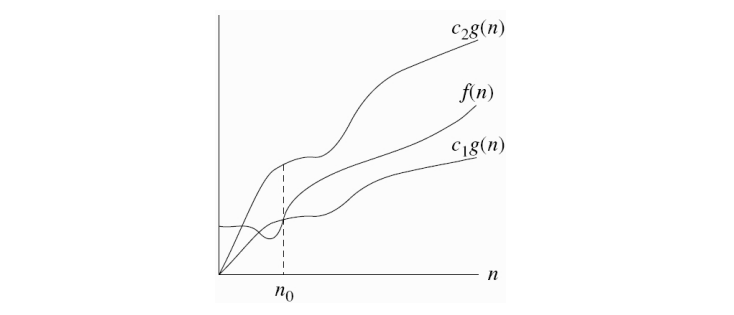
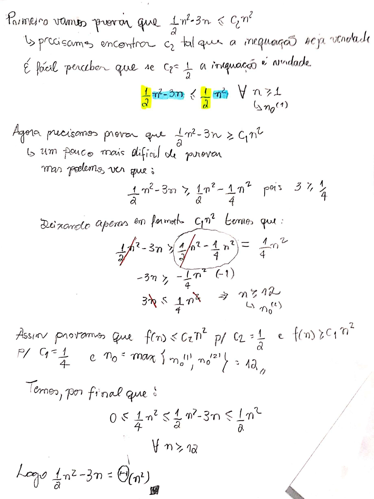
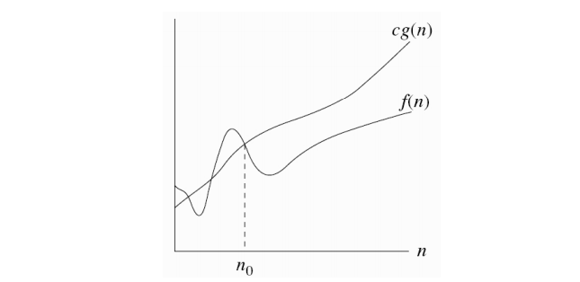
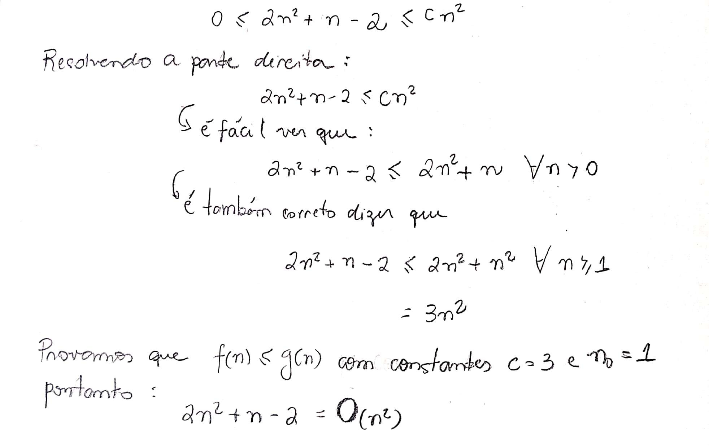
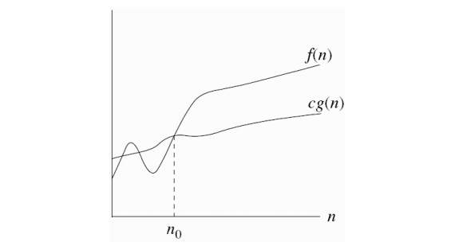
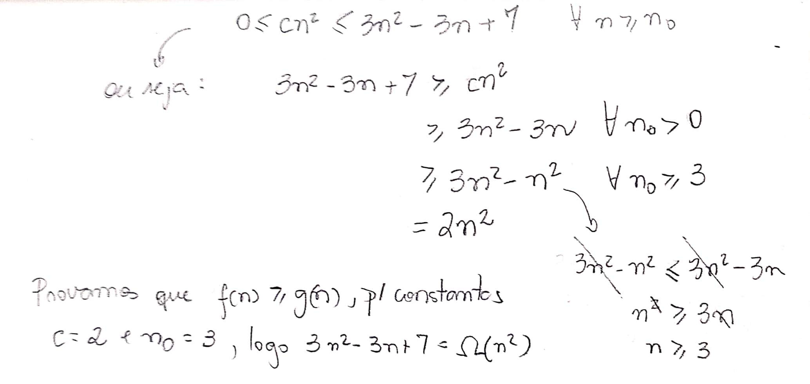
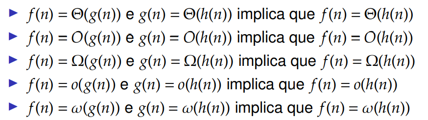
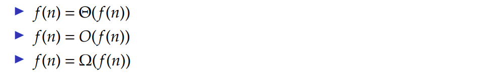
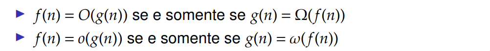

# Crescimento de funções

## Ordem de Crescimento

Retomando a aula passada, estudamos a taxa de crescimento de funções do tempo de execução de algoritmos, ou ordem de crescimento para avaliar a sua eficiência. Essa ordem também permite realizar a comparação com outros algoritmos relativos.

Geralmente estudamos algoritmos levando em conta o crescimento ao infinito do número de entrada. Assim, os coeficientes e termos de menor ordem da função não causam grande impacto no tempo de execução e para isso eles são descartados para fins de simplificação. Desse modo, estudamos a eficiência assintótica dos algoritmos.

## Notação $$\Theta$$ 

Essa é uma das informações mais essenciais do curso de Análise de Algoritmos. E entendo-a é possível entender outras notações.

Com base na definição do livro do Cormen:

Dada uma função $$g(n)$$ , denotamos $$\Theta (g(n))$$ o conjunto de funções:

$$\Theta (g(n))$$ = {$$f(n)$$: existem constantes positivas $$c_1$$ , $$c_2$$e $$n_0$$tais que $$0 \leq c_1g(n) \leq f(n) \leq c_2g(n)$$ para todo $$n \geq n_0$$ }.

$$g(n)$$é **assintoticamente justo** para $$f(n)$$ se $$f(n) \in g(n)$$e toda $$f(n) \in g(n)$$é **assintoticamente não negativa** por definição, sendo assim, $$g(n)$$também é.

## O que fazemos agora?

Vemos o que é a definição dessa notação mas e agora? Podemos provar, por meio dessa definição que algumas funções pertences a outras. Como o exemplo abaixo:

### Como mostrar que $$\frac{1}{2}n^2 −3n = \Theta(n^2)$$ ?

Basta mostrarmos que existem constantes positivias c1 e c2 que satisfazem a inequação:

$$
0 \leq c_1n^2 \leq \frac{1}{2}n^2 −3n \leq c_2n^2
$$

para todo $$n \geq n_0$$ 

### Prova

Para substituir a expressão $$f(n) \in g(n)$$, usualmente escrevemos que $$f(n) \in g(n)$$.

Em geral podemos utilizar essa lógica para qualquer polinômio $$ p(n) = \sum_{i=0}^{d} a_in^i$$ . Ou seja, para constantes $$a_i$$ constantes e $$a_d > 0$$ , temos que $$p(n) = \Theta(n^d)$$ .

Consequentemente é verdade que $$\Theta(n^0) = \Theta(1)$$ para funções constantes.

## Notação $$O$$ 

Dada uma função $$g(n)$$ , denotamos $$O (g(n))$$ o conjunto de funções:

$$O (g(n))$$ = {$$f(n)$$: existem constantes positivas $$c$$ ,e $$n_0$$tais que $$0 \leq f(n) \leq cg(n)$$ para todo $$n \geq n_0$$ }.

A notação $$O$$ é uma parte da notação $$\Theta$$, pois ela é a definição somente do **limitante superior**. Neste caso é somente necessário descobrir duas constantes.

### Como mostrar que $$2n^2 +n−2 = O(n^2)$$ ?

Temos que mostrar que  $$0 \leq 2n^2 +n−2 \leq cn^2$$, para todo $$n \geq n_0$$.

### Prova

### Observações

A notação $$O$$ como já sabemos é uma definição que limita somente superiormente a função $$f(n)$$ . Sendo assim, quando utilizamos ela para expressar o tempo de execução de um algoritmo no pior caso, é correto dizer que a função é limitante para toda e qualquer entrada do algoritmo.

Dessa forma podemos também expressar o tempo de execução do algoritmo Insertion Sort como $$O(n^2)$$para qualquer entrada. Porém não é correto dizer que $$\Theta(n^2)$$, sendo um limitante do tempo de execução de pior caso do Insertion Sort, é um limitante para qualquer entrada do algoritmo pois vimos que no melhor caso é $$O(n)$$.

**É importante saber que**: quando dizemos que "o tempo de execução é $$O(n^2)$$", não significa que para qualquer entrada do algoritmo o tempo de execução é este , pois dependendo da entrada, o tempo varia. Mas queremos dizer que para qualquer tamanho de entrada escolhida, o tempo de execução é limitado por cima por $$O(n^2)$$. É equivalente dizer que $$O(n^2)$$é o tempo de execução no pior caso, pois ele abrange os menores.

## Notação $$\Omega$$ 

Dada uma função $$g(n)$$ , denotamos $$\Omega (g(n))$$ o conjunto de funções:

$$\Omega (g(n))$$ = {$$f(n)$$: existem constantes positivas $$c$$ ,e $$n_0$$tais que $$0 \leq cg(n) \leq f(n)$$ para todo $$n \geq n_0$$ }.

Também podemos perceber que a notação $$\Omega$$também é uma parte da notação $$\Theta$$. Podemos dizer que a notação$$\Theta$$é a mais forte de todas. A notação $$\Omega$$é uma função que limita inferiormente $$f(n)$$ .

### Como mostrar que $$3n^2 −3n+7 = \Omega(n^2)$$ ?

Basta mostrarmos que $$0 \leq cn^2 \leq 3n^2-3n +7$$ , para todo $$n \geq n_0$$.

### Prova

### Obervações

Podemos dizer então que no algoritmo Insertion Sort, o tempo de execução é $$\Omega(n)$$ para qualquer entrada. Pois não importa o tamanho da entrada escolhida, o tempo de execução do algoritmo é **pelo menos** $$\Omega(n)$$. Ou seja, o tempo de execução no melhor caso é $$\Omega(n)$$.

## Relação entre notações assintóticas

Já vimos que existem notações que limitam superiormente, inferiormente e tanto inferior quanto superior, assim podemos estabelecer uma relação entre essas notações como diz o teorema abaixo:

### Teorema

Para quaisquer duas funções $$f(n)$$ e $$g(n)$$ , temos $$f(n) = Θ(g(n))$$ se e somente se $$f(n) = O(g(n))$$ e $$f(n) = Ω(g(n))$$ .

## Outras notações

Existem também notações não muito usuais que são derivadas das notações acimas. São elas $$o, \omega $$ .

## Notação $$o$$ 

Dada uma função $$g(n)$$ , denotamos $$o (g(n))$$ o conjunto de funções:

$$o (g(n))$$ = {$$f(n)$$: para qualquer constante $$c >0$$ ,existe uma constante positiva$$n_0$$tal que $$0 \leq f(n) < cg(n)$$ para todo $$n \geq n_0$$ }.

É uma notação mais forte que $$O$$ pois ela garante que $$f(n)$$seja **estritamente menor** que $$cg(n)$$ para **qualquer** constante  $$c >0$$.

Isso significa dizer que, quando o tamanho da entrada crescer ao infinito a função $$f(n)$$torna-se insignificante se comparada a função $$g(n)$$. Ou seja:

$$
\lim_{n\to\infty} \frac{f(n)}{g(n)} =0
$$

## Notação $$\omega$$ 

Dada uma função $$g(n)$$ , denotamos $$\omega (g(n))$$ o conjunto de funções:

$$\omega (g(n))$$ = {$$f(n)$$: para qualquer constante $$c >0$$ ,existe uma constante positiva$$n_0$$tal que $$0 \leq cg(n) <  f(n) $$ para todo $$n \geq n_0$$ }.

Similarmente a notação anterior podemos extrair a propriedade por meio de limites também. Ou seja, para entradas que se aproximam do infinito, temos que  $$f(n)$$ é muito maior que $$g(n)$$. Ou seja:

$$
\lim_{n\to\infty} \frac{f(n)}{g(n)} =\infty
$$

## Comparação de funções

### Transitividade

### Reflexividade

### Simetria

### Simetria Transposta

## Continua...

> Conteúdo tirado dos slides do professor da disciplina **Fábio Henrique Viduani Martinez** - FACOM/UFMS; Todos os créditos reservados a ele.

