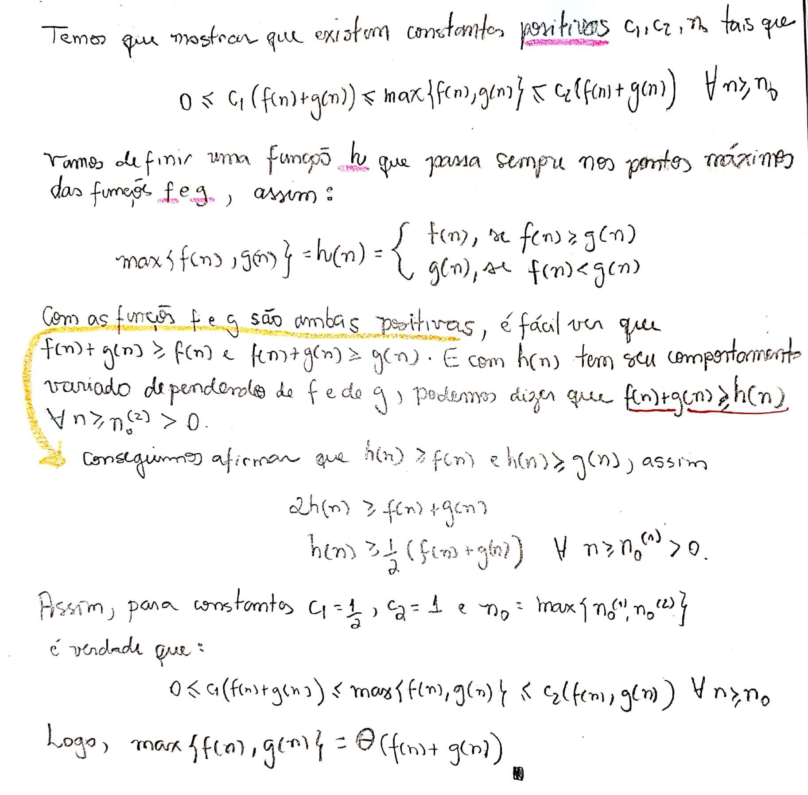
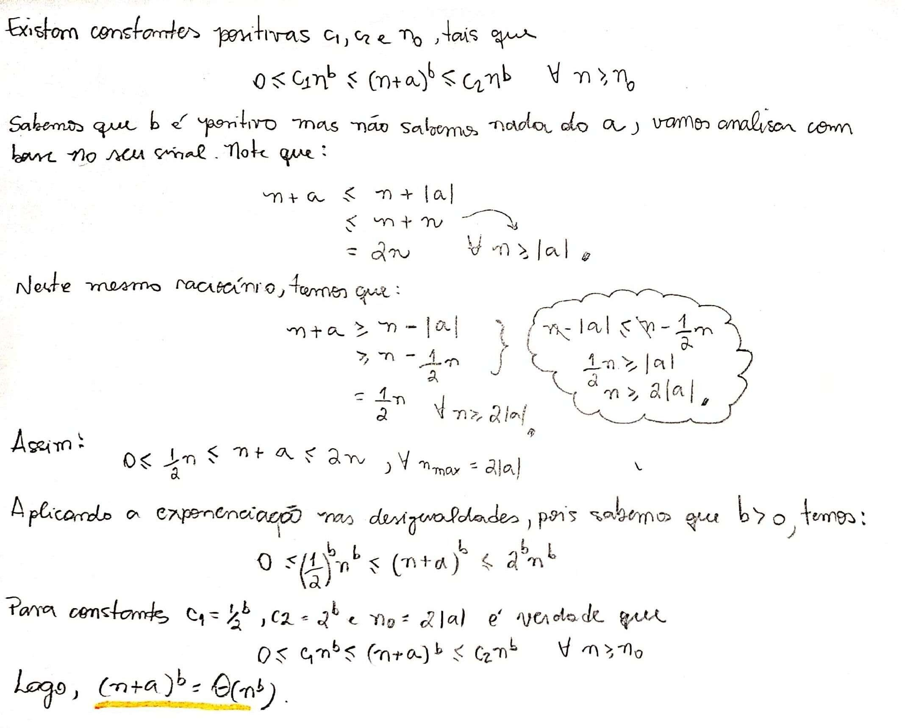
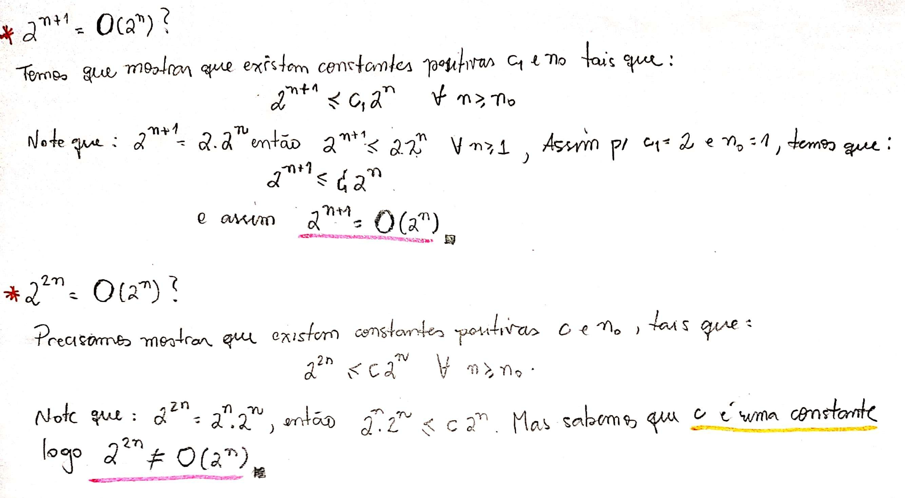

# Exercícios

## 3.1-1\)

#### Sejam $$f(n)$$ e $$g(n)$$ duas funções assintoticamente não negativas. Usando a definição da notação $$\Theta$$ , mostre que $$max\{f(n), g(n)\} = Θ(f(n) + g(n))$$

Conforme pedido, temos que mostra a igualdade utilizando-se da notação vista na disciplina.

#### Solução

## 3.1-2\)

#### Mostre que para quaisquer constantes reais a e b, com b &gt; 0, $$ (n + a)^b = Θ(n)^b$$ .

Então com base na definição devemos mostrar que:

## 3.1-4\)

#### $$2^{n+1} = O(2^n)$$ ? E $$2^{2n} = O(2^n)$$ ?

