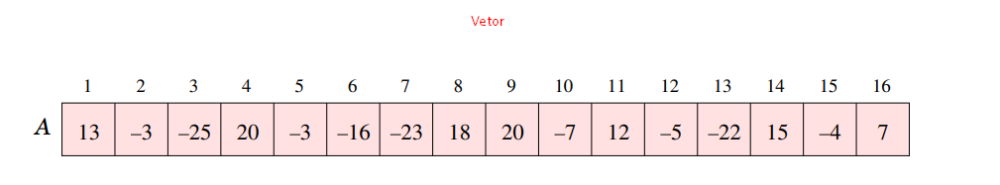
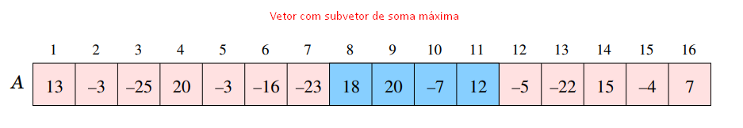
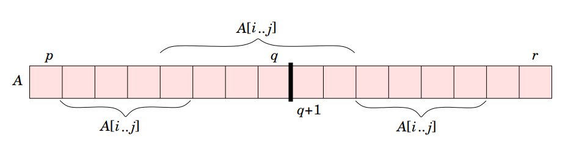
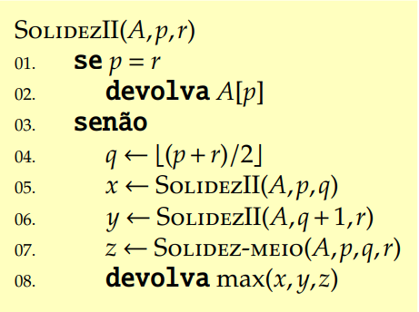
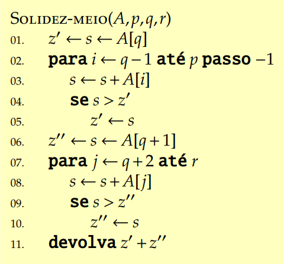
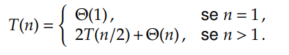
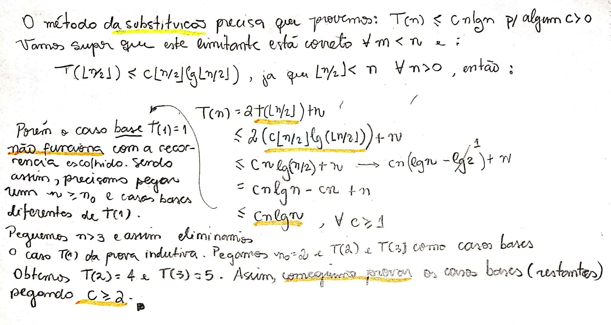

# Divisão e conquista

## Merge Sort

Anteriormente vimos que o algoritmo Merge Sort é um exemplo que utiliza a técnica de divisão-e-conquista. Onde ele **divide** o problema em subproblemas, **conquista** \(soluciona\) cada subproblmea e depois **combina** as soluções em um só.

## Recorrências

Recorrências estão intrinsicamente ligadas ao método de divisão-e-conquista pois elas são uma forma de caracterizar o tempo de execução de algoritmos recursivos. 

**Recorrências** são inequações que descrevem funções sobre os seus termos menores. Como é o caso da demonstração da função da quantidade de movimentos que você realiza para completar a Torre de Hanói.

## Motivação

Imagina por exemplo uma grandeza que varia de acordo com o tempo. Ora cresce, ora descresce. Tomamos como exemplo, ações na bolsa de valores. Dependendo do dia a ação pode valorizar ou desvalorizar. Temos que encontrar um determinando intervalor em que essa grandeza acumulada seja máxima. Esse é um problema bastante conhecido chamado _**problema da soma-máxima**_. E para resolvermos precisamos saber alguns **conceitos**.

* um **segmento** de um vetor A\[p..r\] é qualquer subvetor da forma A\[i..k\], com $$p \leq i \leq k \leq r$$ 
* a **soma** de um segmento A\[i..k\] é o valor $$A[i]+A[i+1]+···A[k]$$ 
* a **solidez** de um vetor A\[p..r\] é a soma de um segmento de soma máxima

## Problema computacional

### Problema do segmento de soma máxima

Dado um vetor $$A[p..r]$$ de números inteiros, com $$r−p+1 > 1$$ , calcular a **solidez** de $$A[p..r]$$ .

Podemos resolver o problema utilizando força-bruta, ou seja, ir somando cada subvetor existente até achar a solidez. Mas também podemos resolver utilizando a ténica de divisão-e-conquista. Através de um algoritmo recursivo.

Vejamos este problema com o vetor abaixo:

Agora tentem identificar o subvetor com soma máxima.

Como fazemos esse raciocínio utilizando divisão-e-conquista?

Primeiro sabemos que podemos **dividir** o vetor em dois, considerando o **piso** caso seja ímpar. Assim temos 3 possibilidades de ocorrência da solidez dentro do vetor dividido. Sendo elas: a solidez na primeira metade, a solidez na segunda metade e a solidez entre as metades.

O algoritmo se comporta semelhante ao Merge Sort. Ele divide, como mostrado acima, o vetor em 3 partes. Ele divide a primeira metade, a segunda metade e a terceira ele some o meio. Vamos entender no algoritmo abaixo.

Podemos perceber que o algoritmo, recursivo, é quase idêntico ao Merge Sort, onde ele divide recursivamente o vetor e no final combina na linha 7. Vejamos o que a linha 7 executa:

A solidez meio vai percorrer, na linha 2, a **primeira metade** do vetor \(de cada chamada recursiva\), armazenando na variável $$z'$$ a soma máxima da primeira metade. Já na linha 7 ele vai armazenar na variável $$z''$$ a soma máxima da **segunda metade** da divisão do vetor \(de cada chamada recursiva\), no final, ele soma as duas variáveis \(o **meio** do vetor\) e devolve, completando a instrução.

### Análise do algoritmo

É fácil ver que o tempo de execução do algoritmo Solidez-Meio é $$\Theta(n)$$ . Pois ele percorre o vetor inteiro de tamanho $$n$$ somente uma vez. No primeiro Para, ele percorre a primeita metade e no segundo Para, ele percorre o restante do vetor.

Já o tempo de execução da Solidez II, perceba que o algoritmo além de executar o Solidez-Meio, que sabemos ser $$\Theta(n)$$,  ele faz **duas chamadas recursivas** com **metade** do tamanho do vetor. Sendo assim, temos a seguinte recorrência: 

Está recorrência é a mesma que descobrimos para o algoritmo Merge Sort anteriormente. Sendo assim, já sabemos que seu tempo de exeução é: $$T(n) = Θ(nlgn)$$ .

## Como resolvemos recorrência

Geralmente em disicplinas de análise de algoritmos é comum já termos prontos recorrências e pedir para mostrarmos ela em função do tamanho da entrada. Assim a ideia geral para resolvermos é primeiro **adivinhando** a solução para recorrência como é o caso da Solidez. Adivinhamos que seria $$T(n) = Θ(nlgn)$$mas agora **precisamos provar**. E com isso, utilizamos **indução**.

Então seja $$T(n) = 2T(\lfloor n/2c \rfloor)+n$$ uma recorrência. Advinhamos que a solução é $$ O(nlgn)$$. Vamos provar por **substituição**.

#### Prova

## Continua...

> Conteúdo tirado dos slides do professor da disciplina **Fábio Henrique Viduani Martinez** - FACOM/UFMS; Todos os créditos reservados a ele.

