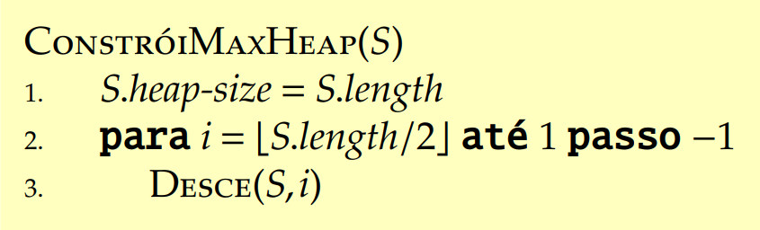

# Heapsort

## Definição

Heap é uma coleção de elementos que são ordenados por suas prioridades e armazenados em um vetor S que satisfaz a propriedade abaixo:

$$
S[\lfloor i/2 \rfloor ] \geq S[i]
$$

para todo $$i > 1$$ 

Um vetor que satisfaz essa propriedade é chamado de max-heap.

## Heap como árvores binárias

É díficil enxergar esta propriedade olhando diretamente para um vetor. Mas o heap, pela propriedade, pode ser identificado como uma árvore cheia e assim pode ser representado visualmente.

Imagem: [https://simpledevcode.wordpress.com/2015/08/05/the-heap-data-structure-c-java-c/](https://simpledevcode.wordpress.com/2015/08/05/the-heap-data-structure-c-java-c/)

## Altura do Heap

A altura do heap é vista visualmente na se olharmos para o vetor como uma árvore binária acima. Sendo assim, a altura de um nó no heap é o número de arestas no caminho mais longo dele até chegar numa folha.

E a altura de um vetor heap é a altura do nó raiz. E como conseguimos visualizar o heap como uma árvore bináiras, sabemos então que sua altura é $$\Theta(lgn)$$ . E suas operações básicas seguem a mesma proporção de sua altura.

## Opreações básicas

* Pai de um nó: $$\lfloor i/2 \rfloor$$ 
* Filhos esquerdo de um nó: $$2i$$ 
* Filho direito de um nó: $$2i+1$$ 

Dessa forma a primeira propriedade que vimos acima pode ser traduzida para: 

$$
S[Pai(i)] \geq S[i]
$$

## Problema

Dado um vetor de inteiros S com n &gt; 0 elementos e um índice i, se olharmos para S como uma árvore binária, para transformar em um max-heap temos que olhar para um determino índice i e identificarmos se suas subárvores, direita e esquerda são max-heap, com isso podemos encaixar o indíce i em seu lugar corretamente com o algoritmo abaixo e corrigindo a propriedade fundamental do max-heap.

## Algoritmo _Desce_

### Tempo de Execução

Para sabermos o tempo de execução do algoritmo precisamos analisar o tempo de cada linha do algoritmo.  Mas sabemos que as linhas de 1 a 8 são atribuições e comparações de elementos e que custam tempo $$\Theta(1)$$ .  E esse tempo é somado com a chamada recursiva do algoritmo caso ocorra de o maior elemento ser diferente de i. E quantas vezes a chamada recursiva pode ser chamada?

Nesse caso precisamos analisar a altura da árvore. Como sabemos que o heap é uma árvore binaria cheia, a altura das subarvores são iguais ou possuem um nível a mais.  Nesse caso se cada árvore tiver x elementos, o heap inteiro teria x + x + 1 \(raiz\) elementos = 2x + 1. Mas temos que considerar o PIOR CASO. Que é no caso da árvore estar mais ou menos desbalanceada para um lado de uma subárvore, neste caso qual o número máximo de nós que podem existir no nivel abaixo? Considerando o número total de elementos do heap como x, o número máximo no nível inferior é x+1. 

Agora somando os elementos da subárvore desbalanceada com relação a árvore total temos: 2x + 1 na árvore desbalanceada e 3x + 2 na árvore total.

Assim conseguimos ver que no pior caso, a taxa de proproção de um heap é 2/3. Logo, o tempo de execução do pior caso do algoritmo é a seguinte recorrência:

$$
T(n) = T(2n/3)+\Theta(1)
$$

Utilizando o teorema mestre para descobrirmos a forma assintótica da recorrência, caimos no caso 2 e  temos que $$T(n) = \Theta(lgn)$$ .

## Problema

Com o algoritmo Desce, conseguimos usá-lo para transformar qualquer vetor de números inteiros em um max-heap.

### ConstroiMaxHeap

O algoritmo constroiMaxHeap faz isso com a ajuda do algoritmo Desce. Ele começa na metade da árvore no qual é o último nó com filhos, que garante que é uma subárvore max-heap e assim podemos começar a usar o algoritmo Desce. E depois ele vai subindo na árvore descendo elementos que precisam. 

### Correção do algoritmo

\#TODO

### Tempo de Execução

Como o algoritmo Desce possui tempo de execução, como já vimos, $$\Theta(lgn)$$e ele é executado n/2 vezes que é limitado por $$O(n)$$ , temos que o ConstróiMaxHeap possui tempo de exeução $$\Theta(nlgn)$$.

Mas podemos fazer uma análise melhorada deste tempo considerando a altura do heap e chegamos a conclusão de que o tempo de execução é $$O(n)$$.

## Algoritmo HeapSort

Com os dois algoritmos que vimos acima podemos desenvolver um algoritmo de ordenação com auxílio desses dois procedimentos. 

Como sabemos o tempo de execução dos dois procedimentos que o HeapSort utiliza, conseguimos saber o tempo de exeução dele. Ele primeiramente constroi um vetor qualquer de n elementos em um max-heap utilizando o algoritmo ConstroiMaxHeap que tem tempo de execução $$O(n)$$ e executa o algoritmo Desce n-1 vezes com tempo de execução $$\Theta(lgn)$$. Então concluímos que o HeapSort tem tempo de execução $$\Theta(nlgn)$$.

> Conteúdo tirado dos slides do professor da disciplina **Fábio Henrique Viduani Martinez** - FACOM/UFMS; Todos os créditos reservados a ele.

