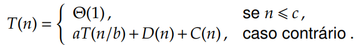

# Introdução à Análise de Algoritmos

## Problema da Ordenação

Voltamos novamente para falar sobre o problema da ordenação. E nessa aula vamos analisar realmente o algoritmo de ordenação por inserção \(Insertion Sort\).

**Entrada**: uma sequência de $$n$$ números \( $$a_1, a_2, . . . , a_n$$ \)

**Saída**: uma permutação \( $$a'_1, a'_2, . . . , a'_n$$ \) da sequência de entrada de tal forma que a $$a'_1 \leq a'_2 \leq . . . \leq a'_n$$

## Algoritmo



```c
InsertionSort(A)
    para j ← 2 até A.length
        chave ← A[j]
        //insere A[j] na sequência ordenada A[1..j−1]
        i ← j−1
        enquanto i > 0 E A[i] > chave
            A[i+1] ← A[i]
            i ← i−1
        A[i+1] ← chave
```



Veja o gif sobre o funcionamento [aqui](https://upload.wikimedia.org/wikipedia/commons/thumb/0/0f/Insertion-sort-example-300px.gif/220px-Insertion-sort-example-300px.gif).

## Correção do Algoritmo

### Invariantes e a correção do _Insertion Sort_

O índice j indica a posição atual para qual você está olhando. No início de cada iteração da estrutura de repetição para, o vetor consistindo dos elementos **A\[1..j−1\]** é o atual vetor ordenado até o momento da leitura do j. O restante do vetor **A\[j+1..n\]** são os elemento que ainda não foram analisados. Os elementos em **A\[1..j−1\]** são aqueles que originalmente estavam armazenados neste intervalo do vetor, mas agora estão ordenados.

Para algoritmos iterativos, aqueles que não possuem recursão e tem estruturas de repetição, conseguimos extrair propriedades para explicar que o algoritmo está correto por meio da indução.

A  propriedade do vetor **A\[1..j−1\]** pode ser descrita como um **invariante**: 

No começo de cada iteração da estrutura de repetição **para** das linhas 2–9, o vetor **A\[1..j−1\]** consiste dos elementos originalmente em **A\[1..j−1\]**, mas em ordem crescente.

### Propriedades do invariante

Para provar a correção de um algoritmo por meio do invariante precisamos mostrar 3 coisas.

#### Inicialização

Antes da estrutura de repetição do algoritmo começar, precisamos mostrar que o invariante associado a ela está correto. Seria a base da indução.

#### Manutenção

Depois temos que elaborar a Hipótese de Indução \(H.I\). Se o invariante é válido antes da inicialização, ele permanece verdadeiro antes da próxima iteração.

#### Término

Depois que a estrutura de repetição termina o invariante fornece uma informação importante que determina se está correto.

Agora vamos provar que o algoritmo está correto por meio do invariante utilizando estas propriedades.

1. **Inicialização**: Antes da primeira iteração temos que j=2, sendo assim, o vetor A\[1..j-1\] possui somente um elemento. Logo, o vetor já está ordenado. Isso conclui que o invariante está correto antes da primeira iteração.
2. **Manutenção**: Durante a execução da estrutura de repetição o algoritmo vai movimentar os elemento A\[j-1\], A\[j-2\] ... uma posição para direita até achar a posição correta para o A\[j\]. Quando este é inserido percebemos que o vetor A\[1..j\] foi rearranjado de tal forma que o elementos estejam ordenados. Assim, quando incrementamos o invariante, ele ainda permanece correto.
3. **Término**: A condição de parada da estrutura de repetição é $$ j > A.length = n$$ . Então na próxima iteração o j é j = n+1. Substituindo no invariante A\[1..j-1\] temos que A\[1..n\]. Ou seja, como mostrado na manutenção, esse vetor A\[1..n\] está rearranjado de maneira ordenada e ele é o vetor original completo que antes foi recebido como entrada desordenado mas agora foi rearranjado em ordem crescente. Logo, o algoritmo está correto.
4. Provamos que o algoritmo funciona para **qualquer** entrada n. 

## Generalidades

Quando analisamos um algoritmo, significa dizer que queremos predizer os recursos que ele vai utilizar, como o tempo computacional, memória, etc. Nesta disciplina vamos utilizar um modelo genérico de implementação, máquina de acesso aleatório \(**RAM**\), em que cada instrução tem **custo constante**.

## Análise do Insertion Sort

O tempo gasto pelo Insertion Sort depende do tamanho da entrada, neste caso o tamanho do vetor pois ordenar mil números vai demorar mais que ordenar três. Além disso, o tempo também depende de quão ordenado o vetor já está antes da execução do programa. No geral, analisamos algoritmos em função do número de entrada.

Cada linha do algoritmo gasta um tempo constante $$c$$ . Neste caso vamos denominar cada pelo por $$i$$ e cada constante por $$c_i$$ 


O **custo** é uma constante para cada linha do algoritmo. E precisamos também saber quantas **vezes** cada linha é executada. A primeira linha é executada $$n$$ vezes pois ela começa no 2 e termina a execução comparando com $$n+1$$ , ou seja, $$n$$ vezes. Já as linhas 2, 3, 4 e 8 são executada $$n-1$$ vezes. São as linhas que estão abaixo da linha 1. Sendo assim elas não são executadas pela última vez quando comparar com $$n+1$$ , logo, elas são executas de 2 até $$n$$, que é $$n-1$$vezes.

Já a linha 5 ela não vai depender somente do número de entrada mas sim se $$i > 0$$ e se o conteúdo de $$i$$ for maior que a chave. Nesse caso colocamos ele em função de outra constante que chamamos de $$t_j$$ , e ela será executada de 2 até $$n$$. E as linhas abaixo dela, 6 e 7, serão executada $$t_j-1$$ vezes, seguindo o mesmo princípio supracitado.

O custo total do algoritmo vai depende da multiplicação das constantes pela quantidade de vezes que a linha é executada e a soma de cada uma dessas linhas. Resultando nesta função:

$$
T(n) = c_1n+c_2(n−1)+c_4(n−1)+c_5\sum_{j=2}^{n} t_j + c_6\sum_{j=2}^{n} (t_j-1) +  c_7\sum_{j=2}^{n} (t_j-1) + c_8(n-1)
$$

Nesta expressão total não temos a função T\(n\) somente em função de n. Vamos analisar o melhor caso, ou seja, quando todos os elementos do vetor estão ordenados. Neste caso as linhas 6 e 7 nunca serão executadas pois a comparação da linha 5 sempre será falsa. Assim a função resultante é uma **função linear** de n.

$$
T(n) = (c1 +c2 +c4 +c5 +c8)n−(c2 +c4 +c5 +c8)
$$

Já no pior caso, o vetor está decrescente. E desta forma a linha 5 será executada j vezes e as linhas 6 e 7 j-1 vezes que variam até n. Substituindo na expressão T\(n\), temos uma **função quadrática** de n.

## Ordem de Crescimento

Para analisarmos tempo de execução de um algoritmo vamos considerar termos de maior ordem pois quando colocamos o número de entrada em infinito temos que termos e menor ordem são insignificantes. Assim a taxa de crescimento de um algoritmo vai depender somente do termo de **maior ordem.** A constante do termo de maior ordem também é descartada seguindo o mesmo princípio e assim conseguimos simplificar a função.

Assim dizemos que o tempo de execução do Insertion Sort no pior caso é $$\Theta(n^2)$$ . 

Para determinar então qual algoritmo é mais **eficiente** que outro analisamos qual o algoritmo que possui o **menor** tempo de execução.

## Divisão-e-conquista

Uma solução alternativa são os algoritmos que possuem a técnica de Divisão-e-conquista que melhora consideravelmente o tempo de execução de pior caso. Geralmente estes algoritmos possuem estruturas recursivas. Está técnica divide o problema em sub-problemas que são resolvidos mais rápidos e depois os combinam.

Um dos algoritmos que utiliza esta técnica é o Merge Sort que utiliza o algoritmo auxiliar de intercalação Merge.


Veja o funcionamento do Merge Sort [aqui](https://upload.wikimedia.org/wikipedia/commons/c/cc/Merge-sort-example-300px.gif).

Para provar que o Merge Sort está correto primeiro precisamos escolher o invariante que neste caso é encontrado na execução das linhas 10-18. 

O vetor A\[p..k − 1\] contém os k − p menores elementos de L\[1..n1 + 1\] e R\[1..n2 +1\], ordenados; além disso, L\[i\] e R\[j\] são os menores elementos de seus vetores que não foram ainda copiados de volta para A. Ou seja, os menores vetores possíveis que foram divididos no Merge Sort já está ordenados e o primeiro elemento deles é o menor elemento do vetor.

## Correção do Merge

* **Inicialização**: antes da primeira iteração do laço temos que o vetor A\[p..k−1\] é vazio. Assim antes de inicializarmos o cópia para o vetor original os elementos de L\[i\] e R\[j\] já são os menores elementos.
* **Manutenção**: Primeiro supomos que a parte esquerda é menor ou igual a parte direita, neste caso o menor elemento do vetor L é copiado para o vetor original A e o vetor fica com A\[p..k\] elementos ordenados. O k e o i antes da próxima execução e isso mantêm o invariante igual. O mesmo acontece para quando a parte direita for menor ou igual a parte esquerda. Ou seja o invariante é correto sempre.
* **Término**: ao final da iteração, k é igual a r+1; pelo invariante, o vetor A\[p..k−1\], que é o vetor A\[p..r\], contém os k−p = r−p+1 menores elementos de L\[1..n1\] e R\[1..n2\], ordenados; removidos os sentinelas do algoritmos temos que todos os elementos foram copiados para o vetor original e estão ordenados.

## Tempo de Execução do Merge

Todas as linhas com exceção das que possuem estruturas de repetição gastam tempo constantes. Nesse caso analisando as execuções das linhas 4 e 7 temos que: $$\Theta(n1 +n2) = \Theta(n)$$ . E como as linhas 12–18 são executadas com tempo constante de n vezes temos que no geral o tempo de execução do Merge é $$\Theta(n)$$ 

## Merge Sort

Como já vimos o algoritmo auxiliar, agora vamos analisar o Merge Sort.

```text
MergeSort(A,p,r)
    se p < r :
        q ← b(p+r)/2c
        MergeSort(A,p,q)
        MergeSort(A,q+1,r)
        Merge(A,p,q,r)
```

Podemos ver que na linha 3 é realizada a divisão. As linhas 4-5 a conquista e a linha 6 a combinação.

Como o Merge Sort possui chamadas recursivas é comum em algoritmos como esse utilizarmos uma equação de recorrência pois ela descreve o tempo de execução em função de uma entrada n considerando o mesmo tempo de execução em entradas de tamanhos menores.

## Análise de algoritmos de divisão-e-conquista

Olhando de maneira genérica para algoritmos que utilizam esta técnica, na hora de analisarmos temos que considerar cada passo. 

Se o problema for muito pequeno em que o tempo é comparado a uma constante, facilmente podemos dizer que o tempo é $$\Theta(1)$$ .

Agora, no momento em que a divisão for possível, suponhamos que o algoritmo divida em a subproblemas em que cada subproblema tem tamanho 1/b do tamanho original. Neste caso o tempo gasto para resolver um subproblemas de tamanho n seria T\(n/b\) e para resolver um total de a subproblemas temos que aT\(n/b\). Assim genericamente, temos a seguinte recorrência.



No caso do Merge Sort sabemos que a divisão ocorre duas vezes e cada divisão gasta tempo constante igual a 1 \(pois ele apenas separou o vetor\). Já a conquista temos que depende do algoritmo auxiliar Merge que já provamos o tempo de execução. Assim a recorrência final é:


Executando o algoritmo, sabemos que o algoritmo vai produzir chamadas recursivas até chegarmos numa constante. Ou seja, ele irá dividir o vetor até que sobre somente 1 elemento e não tenha como separar um vetor com um único elemento \(que obviamente está ordenado\). Assim ele realiza essas chamadas de acordo com n entradas fornecidas. Resultando num total de $$T(n) = Θ(nlgn)$$ 

Como sabemos que a função logarítmica cresce menos que a função quadrática, temos que para entradas grandes o algoritmo Merge Sort é mais eficiente que o Insertion Sort no pior caso.


> Conteúdo tirado dos slides do professor da disciplina **Fábio Henrique Viduani Martinez** - FACOM/UFMS; Todos os créditos reservados a ele.


