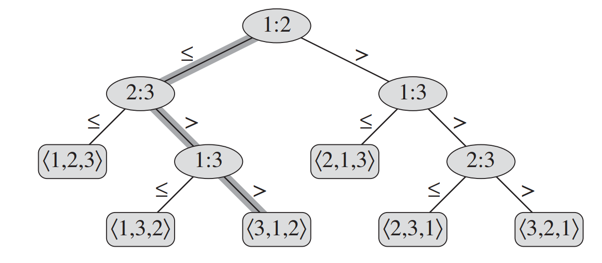
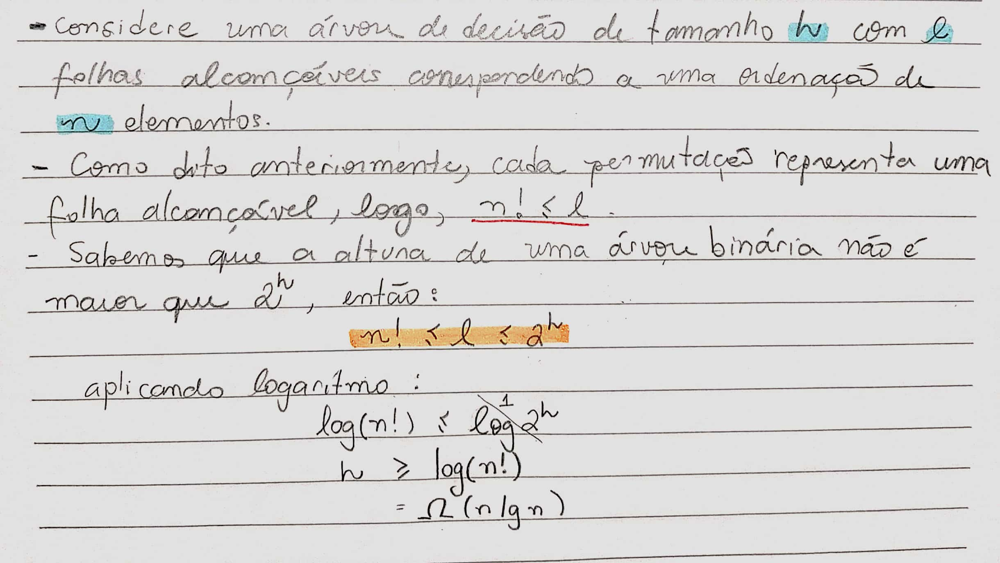
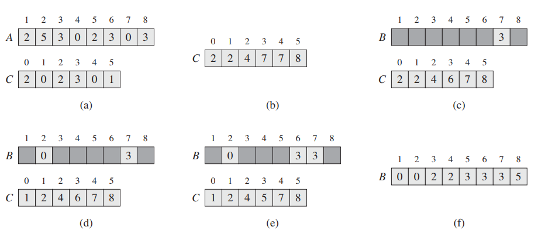
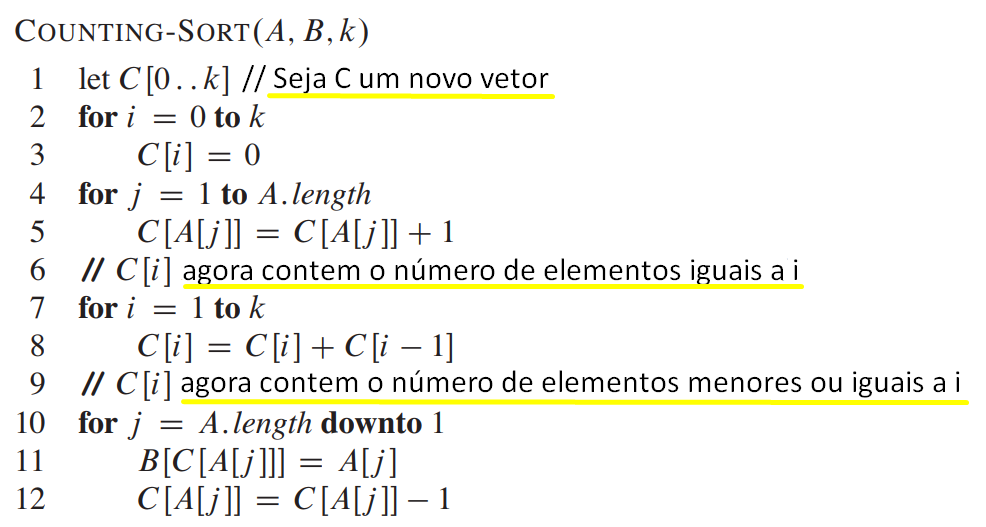
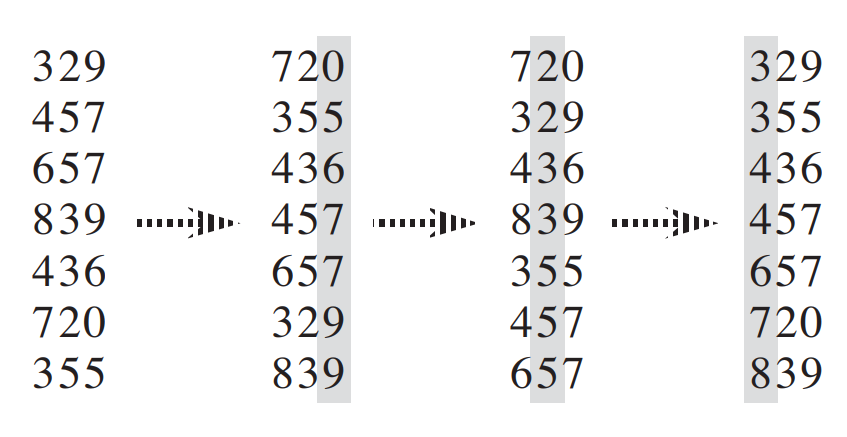
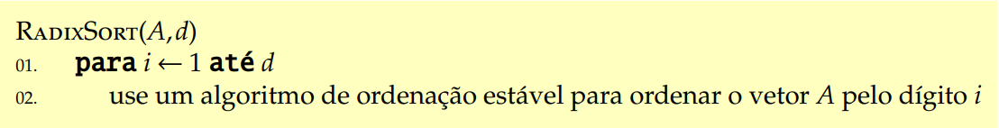
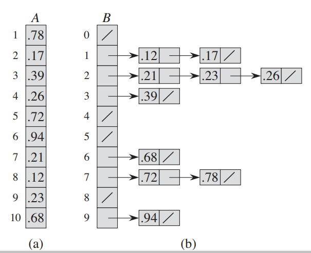
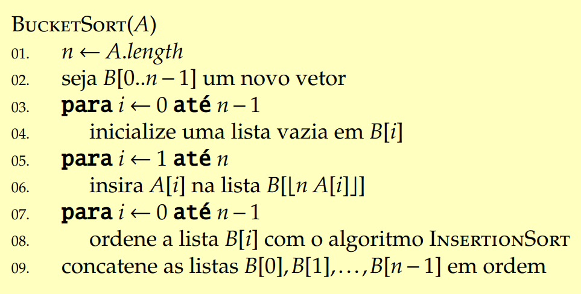

# Ordenação em Tempo Linear

## Introdução

Até agora vimos diversos algoritmos que ordena com tempo de execução $$O(n \lg n)$$. MergeSort e HeapSort possuem esse tempo no pior caso, e o QuickSort, no caso médio.

Uma característica em comum desses algoritmos é que o tempo de execução deles é baseado apenas na quantidade de comparações que é feita entre os elementos, por isso, são chamados de **algoritmos de ordenação por comparação.** Todos que vimos aqui se encaixam neste grupo.

Agora vamos provar que quaisquer desses algoritmos tem tempo de execução no pior caso $$\Omega(n \lg n)$$para ordenar $$n$$ elementos.

Depois estudaremos mais 3 algoritmos: counting sort, radix sort, e bucket sort que possuem tempo linear. São algoritmos que não usam comparação para ordenar os elementos.

## Limites inferiores para ordenação

Sem perda de generalidade vamos considerar que os elementos de entrada para os algoritmos de ordenação por comparação são todos distintos, assim, a comparação de igualdade não vai ser necessária e as comparações de "maior igual" e "menor igual" se tornam equivalentes. Assim, assumimos que que todas as comparações tem forma $$a_i \leq a_j$$ .

## Árvores de Decisão

Podemos ver, abstratamente, algoritmos de ordenação por comparação como termos de uma árvore de decisão. Uma árvore de decisão é uma árvore binária completa que representa comparações entre os elementos dado um certo algoritmo de ordenação sobre uma certa entrada.

A execução do algoritmo em uma árvore de decisão representa o caminho trilhado na árvore da raiz até a folha. Cada nó interno representa uma comparação.

### Limite inferior para o pior caso

O comprimento de um caminho simples mais longo da raiz até a alguma folha, representa o pior caso do total de comparações que, dado algum algoritmo de comparação, performa. Consequentemente, o pior caso de número de comparações para um dado algoritmo de ordenação por comparação é igual à altura de sua árvore de decisão.

Assim, chegamos no Teorema:

## Teorema

Qualquer algoritmo de ordenação por comparação leva $$\Omega(n \lg n)$$ comparações no pior caso.

### Prova

Aqui é suficiente determinar a altura de um árvore de decisão em que cada permutação é uma representação de uma folha alcançável.

### Colorário

Heapsort e MergeSort são algoritmos de comparação assintoticamente ótimos.

## CountingSort

O algoritmo CountingSort assume que cada elemento de entrada é um inteiro que varia de 0 até k, para algum inteiro k.  that each of the n input elements is an integer in the range 0 to k, for some integer k. Quando $$k = O(n)$$ o algoritmo executa em tempo $$\Theta(n)$$.

CountingSort determina, para cada elemento x, o número de elementos menor que x. Ele usa essa informação para colocar o elemento x diretamente na posição corretam, de saída do vetor. Por exemplo, se 17 elementos são menores que x, então x vai estar na posição 18. Dessa forma, vamos modificar um pouco para casos em que os elementos são iguais, para que eles não fiquem na mesma posição.

O algoritmo recebe como entrada um vetor A de n elementos, e usa dois vetores auxiliares, B e C para armazenar os elementos temporariamente.

### Algoritmo

As linhas **2–3** tem tempo $$\Theta(k)$$, as linhas **4–5** tem tempo $$\Theta(n)$$ , as linhas **7–8** , tempo $$\Theta(k)$$, e as linhas 10–12 tem tempo $$\Theta(n)$$. Logo, o tempo total é $$\Theta(k+n)$$ . Na prática, utilizamos o algoritmo quando temos o $$k= O(n)$$ e nesse caso o tempo de execução é $$\Theta(n)$$. CountingSort bate o limitante inferior  $$\Omega(n \lg n)$$ porque não é um algoritmo de ordenação por comparação, está claro que o algoritmo não realiza nenhuma comparação, ele é capaz de devolver um vetor ordenado com pase apenas nos índices dos elementos. 

Uma característica importante do CountingSort é que ele é **estável**. Ou seja, os números de mesmo valor aparece no vetor de saída na mesma ordem do vetor de entrada. Essa característica é importante quando estamos carregando dados satélites no índices dos vetores. Mas a estabilidade desse algoritom é importante por outro motivo: ele é usado como uma subrotina dentro do algoritmo radixsort, e para que o radixsort funcione corretamente, é preciso que o CountingSort seja estável.

## RadixSort

O algoritmo RadixSort era usado em máquinas que ordenavam cartões perfurados. 

O algoritmo ordena por colunas. Por exemplo, números com 3 dígitos, vão ter 3 colunas, o RadixSort então começa a ordenação com a coluna menos significativa do número e assim por diante.

Com base nessa lógica, é necessário que o counting sort seja estável.

### Lema

Dados $$n$$ números de $$d$$ dígitos, nos quais cada dígito pode assumir até $$k$$ valores possíveis, RadixSort ordena corretamente esses números em tempo $$\Theta(d(n+k))$$ se o algoritmo de ordenação estável usado tem tempo $$\Theta(n+k)$$ .

Quando $$d$$ é constante e $$k = O(n)$$ , o tempo de execução do RadixSort é $$\Theta(n)$$.

Como o tempo do RadixSort é $$\Theta(n)$$, é preferível usar ele ao invés de, por exemplo, o QuickSort que tem tempo $$\Theta(n \lg n)$$? Depende muito das características de implementação que dado problema exige. Caso a memória seja um fator importante para o problema, é preferível usar o QuickSort.

## BucketSort

BucketSort assume que a entrada é obtida de uma distribuição uniforme e tem um tempo de execução de caso médio de $$O(n)$$ . Assim como o CountingSort, o BucketSort é rápido porque assume algo sobre a entrada. Considerando que o CountingSort assume que a entrada consiste em inteiros em um pequeno intervalo, o BucketSort assume que a entrada é gerada por um processo aleatório que distribui os elementos de maneira uniforme e independente no intervalo \[0, 1\).

O algoritmo divide o intervalo em sub-intervalos de mesmo tamanho que são chamados de "buckets" \(cestas\) , e distribui os n elementos nessas cestas. Como os elementos de entrada são gerados de maneira aleatória e uniforme, não é esperado que uma cesta receba um grande quantidade de elementos. 

Para produzir a saída, simplesmente ordenamos os números em cada cesta e, em seguida, examinamos as cestas em ordem, listando os elementos em cada uma.

O algoritmo baseia-se na afirmação de que os elementos no vetor satisfazem $$0  \leq A[i] < 1.$$ E ele necessia de um vetor B auxiliar de lista encadeada.

### Algoritmo

Considere dois elementos $$A[i]$$ e $$A[j]$$ . Suponha sem perda de generalidade que $$A[i] \leq A[j]$$ . Como $$\lfloor n A[i]\rfloor  \leq  \lfloor n A[j]\rfloor$$ , então ou $$A[i]$$ é adicionado ao mesmo bucket de $$A[j]$$, ou é adicionado a um bucket de índice menor. Se $$A[i]$$ e $$A[j]$$ vão para o mesmo bucket, então a estrutura de repetição para das linhas 7–8 ordena tais elementos adequadamente. Se $$A[i]$$ e$$A[j]$$ vão para buckets diferentes, então a linha 9 ordena esses elementos corretamente.

### Tempo de Execução

Todas as linhas do algoritmo, exceto a linha 8, têm tempo de execução de pior caso $$O(n)$$ . É necessário analisar o tempo total das $$n$$ chamadas ao **InsertionSort** na linha 8. Para analisar o custo das chamadas ao InsertionSort, seja $$n_i$$ a variável aleatória que denota o número de elementos adicionados ao bucket $$B[i]$$ . como o InsertionSort tem tempo de execução quadrático, o tempo de execução do BucketSort é

$$
T(n) = \Theta(n) + \sum_{i=0}^{n-1}O(n_i^2)
$$

#### Prova

TODO

Temos que o tempo de execução do BucketSort é $$\Theta(n)$$ .

Mesmo que a entrada não seja obtida a partir de uma distribuição uniforme, BucketSort ainda pode ser executado em tempo linear. Desde que a entrada tenha a propriedade de que a soma dos quadrados dos tamanhos das cestas é linear no número total de elementos, a equação nos diz que o BucketSort será executado em tempo linear.

> Conteúdo tirado dos slides do professor da disciplina **Fábio Henrique Viduani Martinez** - FACOM/UFMS; Todos os créditos reservados a ele.

