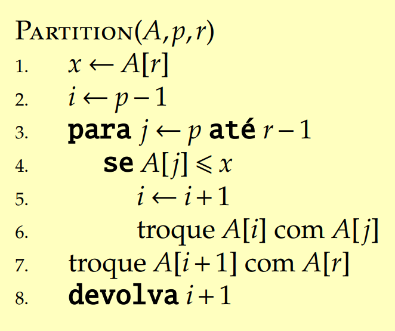
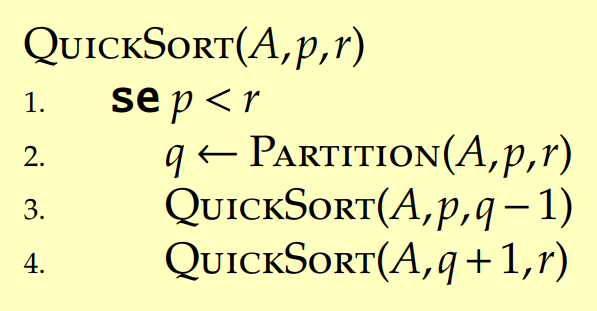
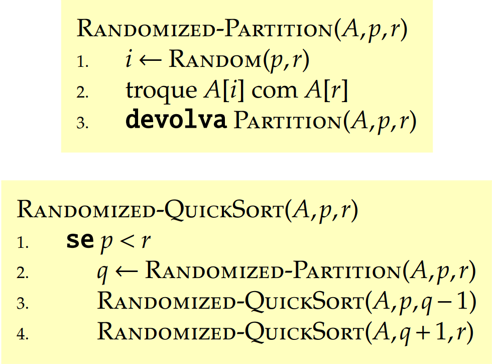
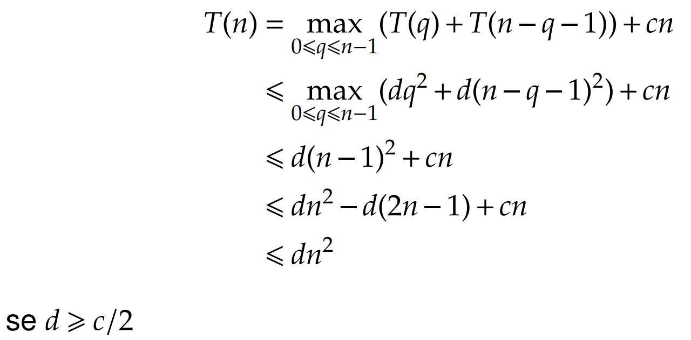
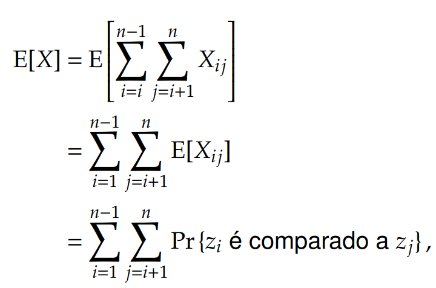
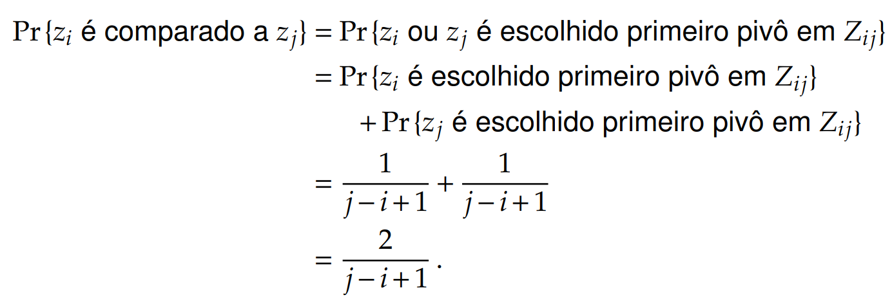
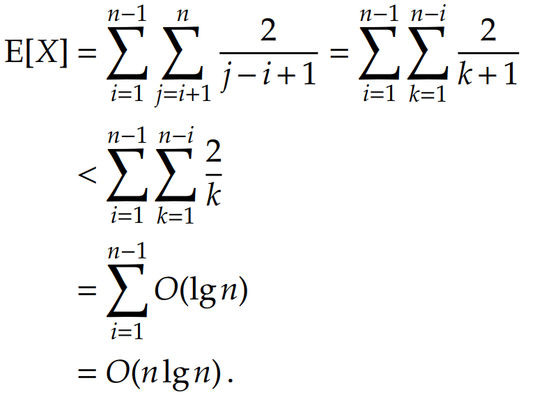

# QuickSort

## Introdução

Ele é chamado também de Algoritmo de ordenação por separação. O tempo de pior caso é $$\Theta(n^2)$$ de um vetor de n elementos. Seu tempo esperado, no entanto, é $$\Theta(n\log n)$$. 

Esse algoritmo é um tanto especial pois o pior caso dele é tão ruim quanto o InsertionSort porém o tempo esperado dele é tão bom quanto o MergeSort. Nesse caso, analisaremos, pela primeira vez, o caso médio desse algoritmo que, apesar do tempo quadrático, é muito utilizado pois conseguimos alterá-lo para que o pior caso raramente aconteça. 

## Divisão-e-conquista

Assim como o MergeSort, o QuickSort também é um algoritmo de divisão-e-conquista, assim se analisarmos cada passo dele, temos:

* **Divida**: com base em um vetor A\[p...r\], vamos rearranjá-lo de tal forma que fiquemos com dois subvetor, um indo de A\[p...q-1\] e outro indo de A\[q+1...r\] sendo que o elemento A\[q\] entre esses dois subvetores já está na posição certa, ou seja, o elemento A\[q\] é maior que todos os elementos de A\[p...q-1\] e menor que todos os elementos de A\[q+1...r\]
* **Conquiste**: ordene os subvetores por meio das chamadas recursivas do algoritmo
* **Combine**: por fim, "grude" os subvetores no elemento A\[q\], cada um do lado correspondente e tenha o vetor A\[p...r\] ordenado.

## Problema da Separação

A parte crucial deste algoritmo é a operação de separação dele onde o elemento A\[q\] precisa ficar na posição correta. Ou seja, a parte difícil do algoritmo é a divisão, sendo a conquista, fácil. Justamente ao contrário do algoritmo MergeSort, onde a divisão é fácil e a combinação difícil.

## Algoritmo Partition

O algoritmo sempre seleciona o último elemento do vetor como um **pivô** para qual o algoritmo vai se basear a separação dos dois subvetores.

### Correção 

\#TODO

### Tempo de Exeução

O algoritmo Partition executa a comparação de todos os elementos do vetor com o pivô, o último elemento. Ou seja, ele executa a estrutura de repetição n-1 vezes e assim temos que o tempo de execução dele é $$\Theta(n)$$ 

## Algoritmo QuickSort

### Tempo de Execução

O tempo de execução do QuickSort depende muito da separação dos elementos e da escolha de seu pivô. Nem sempre a separação dos dois subvetores vai acontecer na metade dos elementos. 

Se o pivô for o maior elemento do vetor, o restante dos elementos ficarão no primeiro subvetor e o segundo subvetor ficará vazio.

### Pior Caso

A situação acima é um exemplo de pior caso do QuickSort, onde um subvetor fica com n-1 elementos e o outro com 0 elementos. Se essa separação ocorrer em cada chamada recusiva, o custo do Partition é $$\Theta(n)$$ .  Nesse caso temos uma chamada para os n-1 elementos e outra chamada para 0 elementos, sendo esse de custo $$\Theta(1)$$ . 

Assim, temos a seguinte recorrência:

$$
T(n) = T(n-1) + T(0) + \Theta(n) \\
= T(n-1) + \Theta(n)
$$

e usando o método de substituição, temos que essa recorrência é $$\Theta(n^2)$$. Esta situação também ocorre quando o vetor já está ordenado e nesse caso o InsertionSort é melhor com tempo $$\Theta(n)$$.

### Melhor Caso

O melhor caso seria justamente ao contrário, onde a separação se dá na metade do vetor com n/2 com subvetores sendo $$\lfloor n/2 \rfloor$$ e $$\lceil n/2 \rceil -1$$.

Com essa situação o QuickSort é muito rápido. E a recorrência seria:

$$
T(n) = T(n/2) + \Theta(n)
$$

Utilizando o caso 2 do teorema mestre, temos que o tempo é $$\Theta(n \log n)$$.

### Caso Médio

 Mas o QuickSort no caso médio, onde a separação é desbalanceada consideravelmente, temos que ele se aproxima mais do melhor caso do que do pior caso. Se considerarmos por exemplo uma proporção de desbalanceamento 9 p/ 1 temos a seguinte recorrência:

$$
T(n) = T(9n/10) + T(n/10) +\Theta(n)
$$

Fazendo a árvore de recursão conseguimos perceber que ela se aproxima de $$\Theta(n \log n)$$. Ou seja, qualquer quebra de proporção constante tem um uma árvore de recursão de altura $$\Theta(n \log n)$$em que cada custo do nível é $$O(n )$$.

## Algoritmo Aleatorizado

Quando a entrada do algoritmo QuickSort é um vetor aleatório temos que levar em conta diversos tipos de separação. Algumas vão ser bem balanceadas e outras altamente desbalanceadas. Então no caso médio, o Partition vai produzir um conjunto de separações boas e ruins. Mas na prática não conseguimos afirmar que a proporção de separações boas e ruins são igualmente prováveis.

Nesse caso, usamos uma amostragem aleatório no QuickSort. Ou seja, ao invés de escolher o último elemento do vetor como o pivô, escolhemos aleatóriamente um elemento de A\[p...r\]

Quando fazemos isso, conseguimos garantir que o pivô escolhido é igualmente provável para qualquer elemento do vetor. Dessa forma, podemos esperar que a separação seja razoavelmente bem balanceada.

#### Como funciona nesse caso?

Primeiro no partition, escolhemos aleatoriamente um pivô dentro do vetor. Trocamos esse pivô com o último elemento e retornamos o Partition Original. O restante é igual ao QuickSort sem aleatorização.

### Tempo de Execução 

Vamos analizar mais profundamente o QuickSort no pior caso. Essa análise também vale para a versão aleatorizada.

Como já vimos, podemos usar o método de substituição para mostrar que o tempo é $$O(n^2)$$. Mas como vimos acima, supomos que o pior caso seria quando ocorresse uma quebra com n-1 elemento de um lado e 0 elementos do outro mas por que seria o pior caso? Temos que analisar cada quebra produzida pelo partition e pega o maior tempo.

Nesse caso a recorrência seria:

$$
T(n)= \max_{0 \leq q \leq n-1}(T(q) + T(n-q-1)) + \Theta(n)
$$

Resolvendo esta recorrência conseguimos provar que o tempo de execução é $$O(n^2)$$.

Como vimos um caso específico que a separação é desbalanceada e seu tempo é então $$\Omega(n^2)$$ , concluímos que o tempo de execução do pior caso do QuickSort é $$\Theta(n^2)$$.

## Tempo de Execução Esperado

Esta parte, vamos mostrar o tempo esperado quando usamos o QuickSort aleatorizado, é $$O(n \log n)$$. Se combinarmos esse limitante com o tempo de melhor caso do QuickSort, temos que o tempo de execução esperado se torna $$\Theta(n \log n)$$.

Como o tempo do QuickSort depende essencialmente da execução do Partition e mais especificamente no tempo dentro de sua estrutura de repetição, temos que começar a analisar ela. A sua estrutura de repetição sabemos que vai ser realizada de p ate r-1, mas a comparação dentro dela depende dos valores dos elementos.

O que temos que fazer então é calcular o número de comparações que são realizadas dentro do Partition. Cada chamada no Partition no Quicksort ocorre no máximo n vezes então o tempo de execução do QuickSort é o total de comparações dentro do Partition \(chamemos de X\) e o número de chamadas do Partition: $$O(n+X)$$ .

Em vez de analisarmos quantas comparações são feitas em cada chamada, olhemos de forma generalizada e para isso temos que entender quando o algoritmo compara e quando não compara. Considere agora o vetor sendo Z e seus elementos z1, z2, ... zn sendo o zi o i-ésimo menor elemento. Definimos Z sendo: zi, zi+1, ..., zj.

Agora analisemos: quando o algoritmo compara zi com zj?

Sabemos que cada par de elemento só é comparado uma única vez já que eles são comparados com o pivô e após o partition o pivô que foi usado nunca mais é comparado.

Vamos definir agora uma variável binária que seja atribuída 1 se zi é comparado com zj e atribuída 0 se zi NÃO é comparado com zj.

$$
X_{ij}= I\{z_i \text{ é comparado com } z_j\}
$$

Essa variável é considerada em qualquer comparação em toda a execução do Partition no QuickSort.

O número total de comparações seria a comparaçao de i variando até n-1 com j variando até n resultando em:

$$
X = \sum_{i=1}^{n-1} \sum_{j=i_+1}^{n} X_{ij}
$$

Como a variável Xij é binária é possivel saber o total de comparações com base na Esperança de X. Logo:

Assim temo sque a esperança de X é a soma da probabilidade de zi ser comparado com zj. Sabemos que o pivô é comparado com todos os elementos de Z apenas uma vez e que depois os dois conjuntos separados não são comparadados. Logo quando zi é comparado com zj? Somente se eles forem escolhidos como pivô. Antes da escolha, o conjunto Z estão na mesma partição, assim a escolha do pivô é igualmente provável para qualquer elemento de Z. Como o conjunto possui j-i+1 elementos a probabilidade de qualquer elemento ser escolhido é 1/j-i+1

Agora podemo substituir na expressão acima e conseguimos realizar a conta:

Assim, utilizando a versão aleatorizada do QuickSort o tempo de Execução Esperado do algoritmo é $$O(n \log n)$$  quando os valores dos elementos são distintos.

> Conteúdo tirado dos slides do professor da disciplina **Fábio Henrique Viduani Martinez** - FACOM/UFMS; Todos os créditos reservados a ele.

