# Seleção do k-ésimo menor elemento

## Motivação

Considera que o menor elemento de um vetor de n elementos é o primeiro na ordem $$(k  = 1)$$ e o maior elemento é o n-ésimo elementos em ordem $$ (k = n)$$ . A mediana, informalmente é o "ponto médio" do vetor. Quando n é ímpar, a mediana é única, ocorrendo em $$k = (n+1)/2$$ . Quando n é par, temos duas medianas, a mediana superior $$(k = \lceil (n+1)/2 \rceil )$$ , e a inferior $$(k = \lfloor (n+1)/2 \rfloor)$$ 

Para simplificação, quando dizemos "mediana" nos referimos a mediana inferior. O problema desse capitulo é selecionar o k-ésimo menor elemento de um vetor com números distintos. Por conveniência, assumimos que sejam distintos, apesar de que, virtualmente, tudo que é feito aqui pode ser extendido para outras situações, quando o vetor contêm elementos repetidos.

## Problema

**Entrada**: um vetor $$A$$ com $$n$$ elementos distintos e um inteiro $$k$$ , com $$1 \leq  k \leq n$$ .

**Saída**: O elemento $$ x \in A$$ é o maior que exatamente $$k-1$$ elementos de $$A$$ .

Podemos resolver o problema de selação em tempo $$O(n \lg n) $$ já que podemos ordenar os elementos usando o **HeapSort** ou **MergeSort** e depois apenas indexar o k-ésimo elemento do vetor de saída. Porém, nesta parte vamos apresentar algoritmos mais rápidos. 

## Mínimo e Máximo

Quantas comparações são necessárias para determinar o menor elemento de um vetor de n elementos? Nós podemos, facilmente, determinar um limitante superior de n-1 comparações:

Examinar cada elemento do vetor e observar o menor já visto até o momento. No algoritmo abaixo, nós analisamos um vetor A com n elementos e guardamos o menor elemento. 

Nós podemos achar o maior com n-1 comparações também. Mas é o melhor que podemos fazer? Sim, pois podemos obter um limite inferior de $$n - 1$$ comparações para o problema de determinação do mínimo. Pense em qualquer algoritmo que determine o mínimo como um torneio entre os elementos. Cada comparação é uma partida do torneio em que o menor dos dois elementos vence. Observando que todos os elementos, exceto o vencedor, devem perder pelo menos uma partida, nós concluem que $$n-1$$ comparações são necessárias para determinar o mínimo. Portanto, o algoritmo MINIMUM é ótimo com relação ao número de comparações realizadas.

### Mínimo e máximo simultaneamente

Em algumas aplicações, precisamos achar ambos, o mínimo e o máximo de um vetor de $$n$$ elementos. Por exemplo, um programa gráfico pode precisar dimensionar um conjunto de dados $$(x, y) $$ para caber em uma tela de exibição retangular ou outro dispositivo de saída gráfica. Para fazer isso o programa precisa determinar o mínimo e o máximo de cada coordenada. 

Fica óbvio agora que é apenas achar o mínimo e o máximo independentemente usando $$\Theta(n)$$ comparações, no qual é assintoticamente ótima. Achando o mínimo e o máximo de forma independente com $$n-1$$ comparações, ficamos com $$2n-2 $$ comparações.  

Podemos achar usando até $$3 \lfloor n/2 \rfloor$$ comparações. Fazemos isso mantendo ambos os elementos vistos até o momento. Em vez de processar cada elemento comparando com o elemento atual com um custo de 2 comparações por elementos, processamos em pares. Nós podemos compara pares de elementos da entrada um com o outro e assim, comparar o menor deles com o atual menor e o maior com o atual maior, com usto de 3 comparações para cada 2 elementos.  

## Seleção em Tempo Esperado Linear

O problema geral de seleção parece mais difícil do que o problema simples de achar o menor. Ainda sim, o tempo de execução assintotico para ambos os problemas é o mesmo: $$\Theta(n)$$ . Aqui vamos ver um algoritmo de divisão-e-conquista chamado RANDOMIZED-SELECT. Ele segue a lógica do QuickSort, mas diferente dele, o RANDOMIZED-SELECT trabalha em apenas um lado da partição. O tempo de execução difere também, enquanto o QuickSort tem tempo $$ \Theta(n \lg n)$$ , o RANDOMIZED-SELECT tem tempo $$ \Theta(n)$$ , assumindo que os elementos são dinstintos. 

RANDOMIZED-SELECT usa o mesmo algoritmo RANDOMIZED-PARTITION visto anteriormente. O algoritmo a seguir é do RANDOMIZED-SELECT e retorna o k-ésimo menor elemento de um vetor $$A[p...r]$$ . 

O tempo de execução de pior caso do algoritmo Randomized-Select é dado pela recorrência: $$T(n) = T(n−1)+ Θ(n), \text{que é } T(n) = Θ(n^2 )$$ e seu tempo de execução esperado é $$Θ(n)$$ .

Para analizar o tempo de execução esperado do RANDOMIZED-SELECT, nós colocamos o tempo do vetor $$ A[p..r] $$ de n elemento em uma variável denotada por $$T(n)$$ , e obtemos um limitante superior $$E[T(n)]$$ . O RANDOMIZED-PARTITION é igualmente esperado retornar qualquer elemeno como pivô. Dessa foma, para cada $$k$$ , em que $$1 \leq k \leq n$$ , o subvetor $$A[p..q]$$ tem $$k$$ elementos \(todos menores ou iguais ao pivô\) com probabilidade $$ 1/n$$ . 

Para $$k = 1, 2, ..., n$$ , nós definimos as variáveis aleatórias do indicador $$X_k $$ onde:

$$X_k = I \{ \text{o subvetor } A[p..q] \text{ tem exatamente } k \text{ elementos } \} ,$$ 

e quando assumimos que os elementos são distintos, temos:

$$E[X_k] = 1/n ,$$ 

Quando chamamos RANDOMIZED-SELECT e escolhemos $$A[q]$$ como pivô, nós não sabemos a priori, se terminaremos imediatamente na resposta correta, se faremos recursão no subvetor $$A[p..q-1]$$ , ou no subvetor $$A[q+1..r]$$ .  Isso depende onde o k-ésimo menor elemento se encontra em relação ao elemento $$A[q]$$ . 

Se assumirmos que $$T(n)$$ é monotonicamente crescente, podemos limitar superiormente o tempo necessário para uma chamada recursiva pelo tempo necessário para uma chamada recursiva sobre a maior porção da entrada. Isto é, para obter um limitante superior, assumimos que o i-ésimo menor elemento está sempre no lado da partição com o maior número de elementos. Para uma dada chamada do RANDOMIZED-SELECT, a variável aleatória indicadora $$X_k$$ tem valor 1 para exatamente um valor de k e 0 para todos os outros valores. Quando $$X_k = 1$$ , os dois subvetores sobre os quais podemos realizar chamadas recursivas têm tamanhos $$ k−1$$ e $$n−k$$ , portanto, temos a seguinte recorrência:

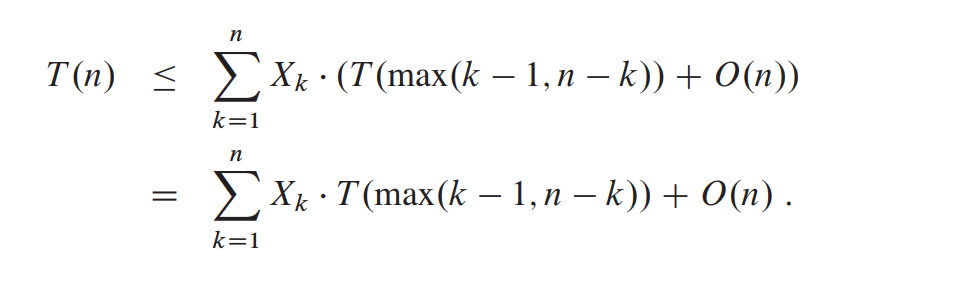

Tirando a esperança na igualdade, temos:

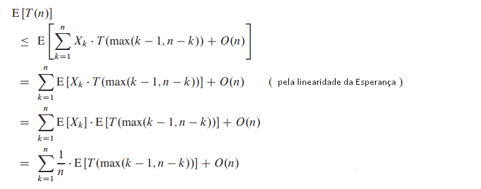

Consedere a expressão $$max(k - 1, n - k)$$ . Temos:

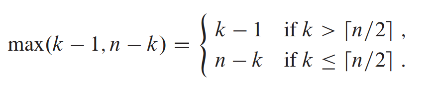

Se n é par, cada termo de $$T(\lceil n/2 \rceil)$$ até $$T(n−1) $$ ocorre exatamente duas vezes no somatório e se n é ímpar, todos esses termos ocorrem duas vezes e $$T(\lfloor n/2 \rfloor)$$ ocorre uma vez, logo

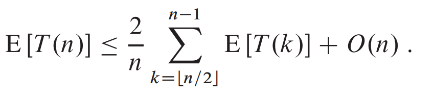

Mostraremos agora que $$E[T(n)] = O(n)$$ , usando o método da substituição. Suponha que $$ E[T(m)] \leq cm$$ para todo $$m < n$$ e alguma constante $$c$$ , que satisfaz as condições iniciais da recorrência. Assuma que $$T(n) = O(1)$$ para n menor que alguma constante. Seja a uma constante tal que a função descrita em $$O(n)$$ é limitada por cima por an para todo $$n > 0$$ . Usando Hipótese de indução, temos:

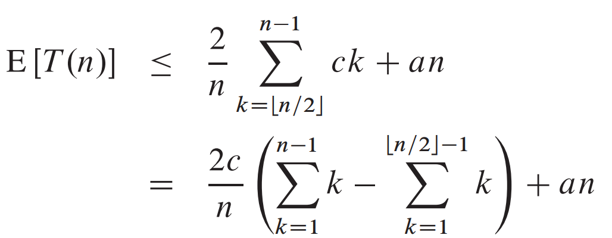

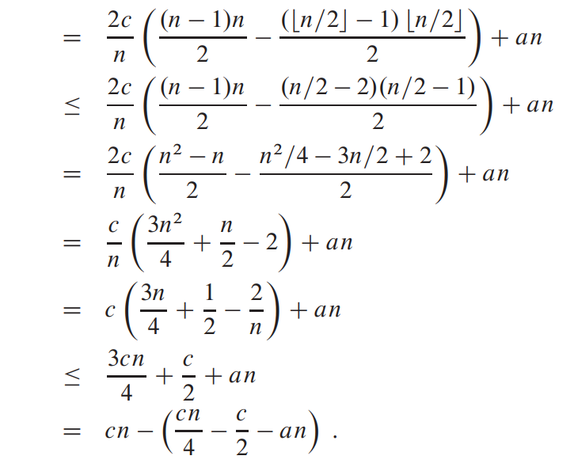

Para completar a prova, devemos mostrar que $$cn/4−c/2−an > 0$$ . Adicionando $$c/2$$ de ambos os lados, temos que $$n(c/4−a) > c/2$$ . Se escolhemos uma constante $$c$$ tal que $$c/4−a > 0$$ , isto é, tal que $$c > 4a$$ , podemos dividir ambos os lados por $$c/4−a$$ e assim:

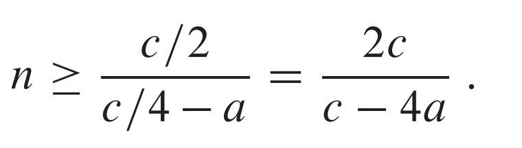

Assim, se assumimos que $$ T(n) = O(1)$$ para $$n < 2c/(c−4a)$$ , então $$E[T(n)] = O(n)$$ . Portanto, podemos encontrar o k-ésimo menor elemento em tempo esperado linear, assumindo que os elementos são distintos.

## Seleção no pior caso em tempo linear

Como o RANDOMIZED-SELECT, o algoritmo SELECT que veremos a seguir encontra o elemento desejado particionando recursivamente o vetor de entrada. Este algoritmo, no entanto, garante boas quebras durante o particionamento do vetor. O algoritmo SELECT usa o algoritmo Partition do QuickSort, mas com uma modificação: o pivô é um parâmetro de entrada.

O SELECT determina o k-ésimo menor elemento de um vetor com $$n > 1$$ elementos distintos, executando os passos a seguir. \(Se n = 1, o SELECT apenas retorna este único elemento com o k-ésimo menor\). 

1. divida os $$n$$ elementos de $$A$$ em $$ \lfloor n/5 \rfloor$$ grupos de 5 elementos cada, mais um último grupo com n mod 5 elementos
2. encontre a mediana dos $$\lceil n/5 \rceil$$ grupos, executando o InsertionSort sobre cada grupo de $$\leq 5 $$ elementos e, em seguida, tomando a mediana do grupo
3. use Select recursivamente para encontrar a mediana x das $$\lceil n/5 \rceil$$ medianas encontradas no passo 2
4. particione A em torno da mediana-das-medianas x, usando a versão modificada do Partition; seja i tal que o número de elementos no lado esquerdo da partição é i−1, x é o i-ésimo menor elemento e existem n−i elementos no lado direito
5. se k = i, devolva x; caso contrário, use Select recursivamente para encontrar o k-ésimo menor elemento no lado esquerdo da partição se k &lt; i ou o \(k−i\)-ésimo menor elemento no lado direito da partição se k &gt; i.

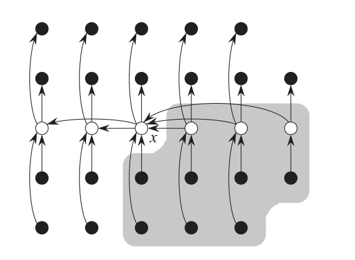

Pelo menos metade dos $$\lceil n/5 \rceil$$ grupos contribuem com pelo menos 3 elementos que são maiores que x, exceto o grupo contendo x e possivelmente o último grupo. Assim, o número de elementos maiores que x é pelo menos

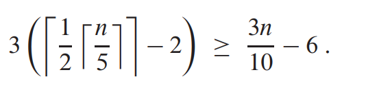

Similarmente, pelo menos $$3n/10−6 $$ elementos são menores que x, assim, no pior caso, o passo 5 chama SELECT recursivamente sobre no máximo $$ 7n/10+6 $$ elementos. Podemos agora estabelecer uma recorrência para o tempo de execução de pior caso $$T(n)$$  do algoritmo. Os passos 1, 2 e 4 têm tempo O\(n\), o passo 3 tem tempo $$T(\lceil n/5 \rceil)$$ e o passo 5 tem tempo $$T(7n/10+6)$$ , portanto, a recorrência para o tempo de execução de pior caso $$T(n)$$ do algoritmo SELECT é:

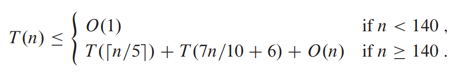

agora usamos o método da substituição para mostrar que $$T(n) = O(n)$$ .

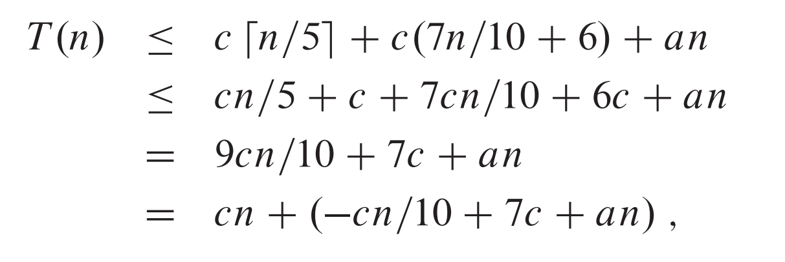

se $$−cn/10+an+7c \leq 0$$ que é equivalente a $$c > 10a(n/(n−70))$$ , quando $$n > 70$$ . Se supomos que $$n \geq 140$$ , por exemplo, então $$n/(n−70) \leq 2$$ e, assim, escolhendo $$c \geq 20a$$ temos o resultado

> Conteúdo tirado dos slides do professor da disciplina **Fábio Henrique Viduani Martinez** - FACOM/UFMS; Todos os créditos reservados a ele.

