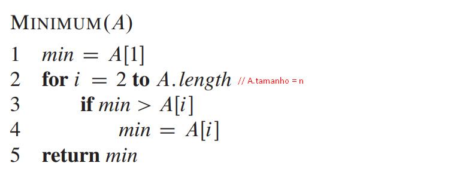
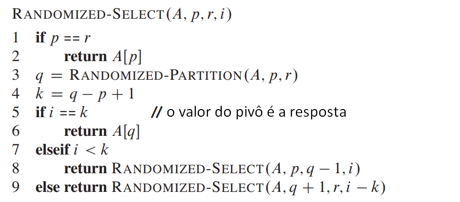

# Seleção do k-ésimo menor elemento

## Motivação

Considera que o menor elemento de um vetor de n elementos é o primeiro na ordem \(k  = 1\) e o maior eelemento é o n-ésimo elementos em ordem \(k = n\). A mediana, informalmente é o "ponto médio" do vetor. Quando n é ímpar, a mediana é única, ocorrendo em k = \(n+1\)/2. Quando n é par, temos duas medianas, a mediana superior \(k = \lceil \(n+1\)/2 \rceil \), e a inferior \(k = \lfloor \(n+1\)/2 \rfloor\)

Para simplificação, quando dizemos "mediana" nos referimos a mediana inferior. O problema desse capitulo é selecionar o k-ésimo menor elemento de um vetor com números distintos. Por conveniência, assumimos que sejam distintos, apesar de que, virtualmente, tudo que é feito aqui pode ser extendido para outras situações, quando o vetor contêm elementos repetidos.

## Problema

Entrada: um vetor A com n elemento distintos e um inteiro k, com 1 \leq  k \leq n.

Saída: : O elemento x \in A é o maior que exatamente k-1 elementos de A.

Podemos resolver o problema de selação em tempo O\(n \lg n\) já que podemos ordenar os elementos usando o HeapSort ou MergeSort e depois apenas indexar o k-ésimo elemento do vetor de saída. Porém, nesta parte vamos apresentar algoritmos mais rápidos. 

## Mínimo e Máximo

Quantas comparações são necessárias para determinar o menor elemento de um vetor de n elementos? Nós podemos, facilmente, determinar um limitante superior de n-1 comparações:

Examinar cada elemento do vetor e observar o menor já visto até o momento. No algoritmo abaixo, nós analisamos um vetor A com n elementos e guardamos o menor elemento. 

Nós podemos achar o maior com n-1 comparações também. Mas é o melhor que podemos fazer? Sim, pois podemos obter um limite inferior de n - 1 comparações para o problema de determinação do mínimo. Pense em qualquer algoritmo que determine o mínimo como um torneio entre os elementos. Cada comparação é uma partida do torneio em que o menor dos dois elementos vence. Observando que todos os elementos, exceto o vencedor, devem perder pelo menos uma partida, nós concluem que n-1 comparações são necessárias para determinar o mínimo. Portanto, o algoritmo MINIMUM é ótimo com relação ao número de comparações realizadas.

### Mínimo e máximo simultaneamente

Em algumas aplicações, precisamos achar ambos, o mínimo e o máximo de um vetor de n elementos. Por exemplo, um programa gráfico pode precisar dimensionar um conjunto de dados \(x, y\) para caber em uma tela de exibição retangular ou outro dispositivo de saída gráfica. Para fazer isso o programa precisa determinar o mínimo e o máximo de cada coordenada. 

Fica óbvio agora que é apenas achar o mínimo e o máximo independentemente usando \Theta\(n\) comparações, no qual é assintoticamente ótima. Achando o mínimo e o máximo de forma independente com n-1 comparações, ficamos com 2n-2 comparações.  

Podemos achar usando até 3 \lfloor n/2 \rfloor comparações. Fazemos isso mantendo ambos os elementos vistos até o momento. Em vez de processar cada elemento comparando com o elemento atual com um custo de 2 comparações por elementos, processamos em pares. Nós podemos compara pares de elementos da entrada um com o outro e assim, comparar o menor deles com o atual menor e o maior com o atual maior, com usto de 3 comparações para cada 2 elementos.  

## Seleção em Tempo Esperado Linear

O problema geral de seleção parece mais difícil do que o problema simples de achar o menor. Ainda sim, o tempo de execução assintotico para ambos os problemas é o mesmo: \Theta\(n\). Aqui vamos ver um algoritmo de divisão-e-conquista chamado RANDOMIZED-SELECT. Ele segue a lógica do QuickSort, mas diferente dele, o RANDOMIZED-SELECT trabalha em apenas um lado da partição. O tempo de execução difere também, enquanto o QuickSort tem tempo \Theta\(n \lg n\), o RANDOMIZED-SELECT tem tempo \Theta\(n\), assumindo que os elementos são dinstintos. 

RANDOMIZED-SELECT usa o mesmo algoritmo RANDOMIZED-PARTITION visto anteriormente. O algoritmo a seguir é do RANDOMIZED-SELECT e retorna o k-ésimo menor elemento de um vetor A\[p...r\]. 

O tempo de execução de pior caso do algoritmo Randomized-Select é dado pela recorrência: T\(n\) = T\(n−1\)+ Θ\(n\), que é T\(n\) = Θ\(n^2 \) e seu tempo de execução esperado é Θ\(n\).

> Conteúdo tirado dos slides do professor da disciplina **Fábio Henrique Viduani Martinez** - FACOM/UFMS; Todos os créditos reservados a ele.

